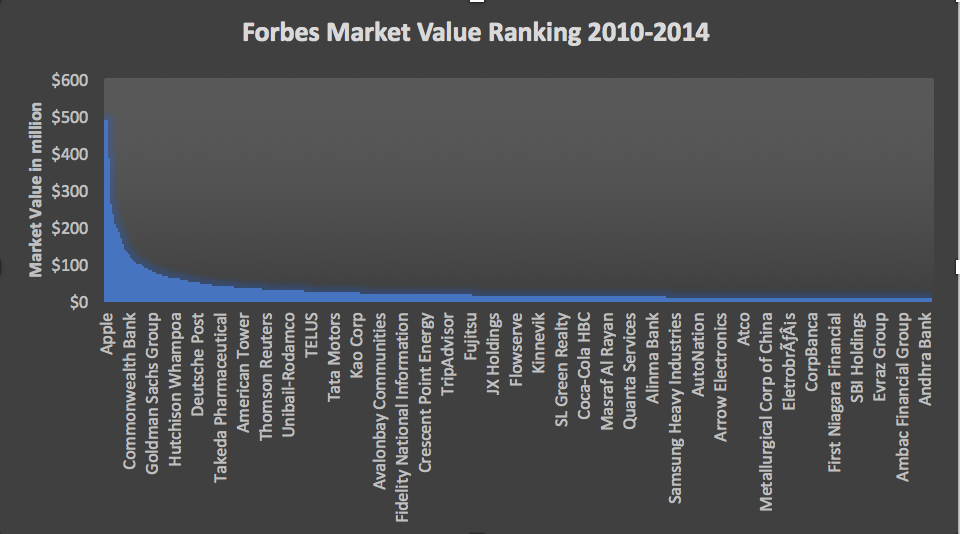
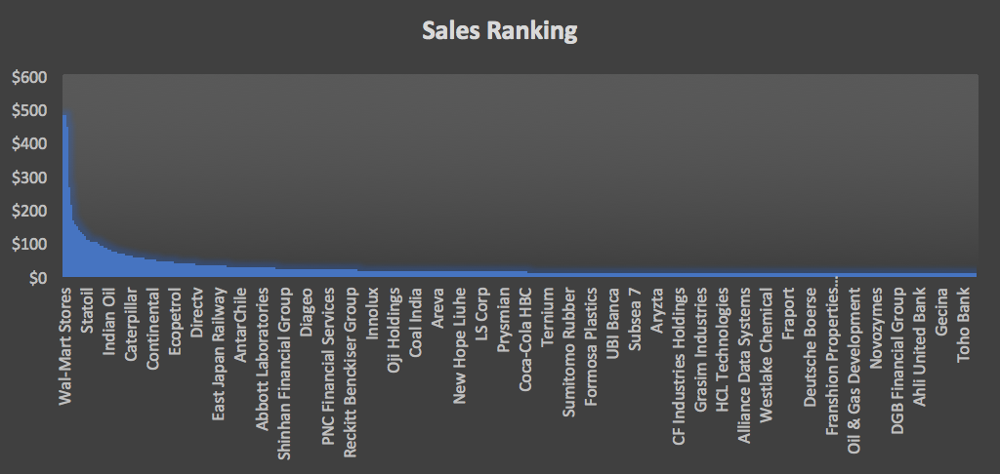
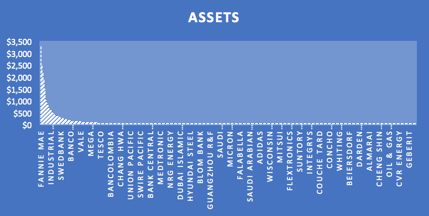
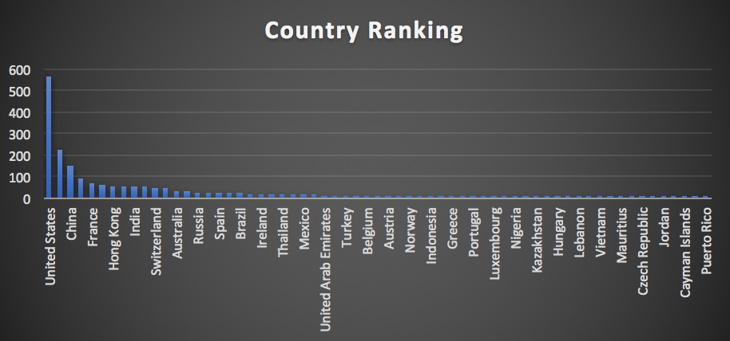
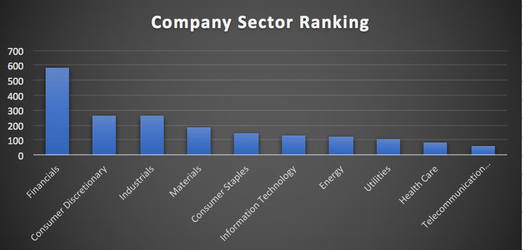

# ICA4
## Q1
Which company has the highest market value & how the rank of market value looks like?

```sql
SELECT company, marketvalue
FROM datasets.forbes_global_2010_2014
ORDER BY marketvalue DESC
```


## Q2
Which company has the highest sales during this time period?

```sql
SELECT company, sales 
FROM datasets.forbes_global_2010_2014
ORDER BY sales DESC
```


## Q3
Which company has the highest assets?

```sql
SELECT company, assets 
FROM datasets.forbes_global_2010_2014
ORDER BY assets DESC
```


## Q4
Which country has the most companies on the forbes ranking?

```sql
SELECT country,
   count(*) as country_rank
FROM datasets.forbes_global_2010_2014
GROUP BY country
ORDER BY country_rank DESC
```


## Q5
Which sector has most companies in the ranking?

```sql
SELECT sector,
   count(*) as sector_rank
FROM datasets.forbes_global_2010_2014
GROUP BY sector
ORDER BY sector_rank DESC
```

